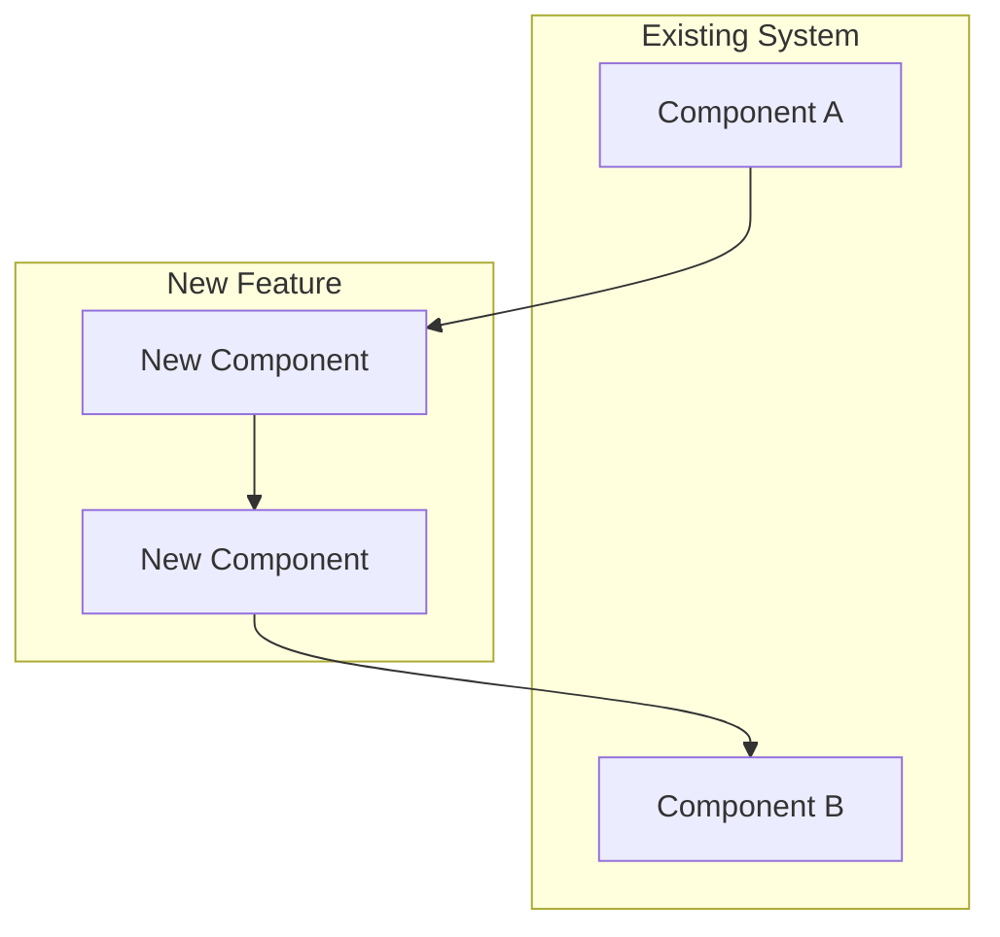
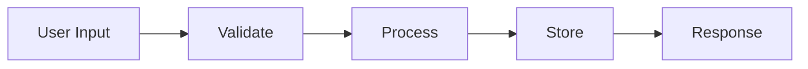
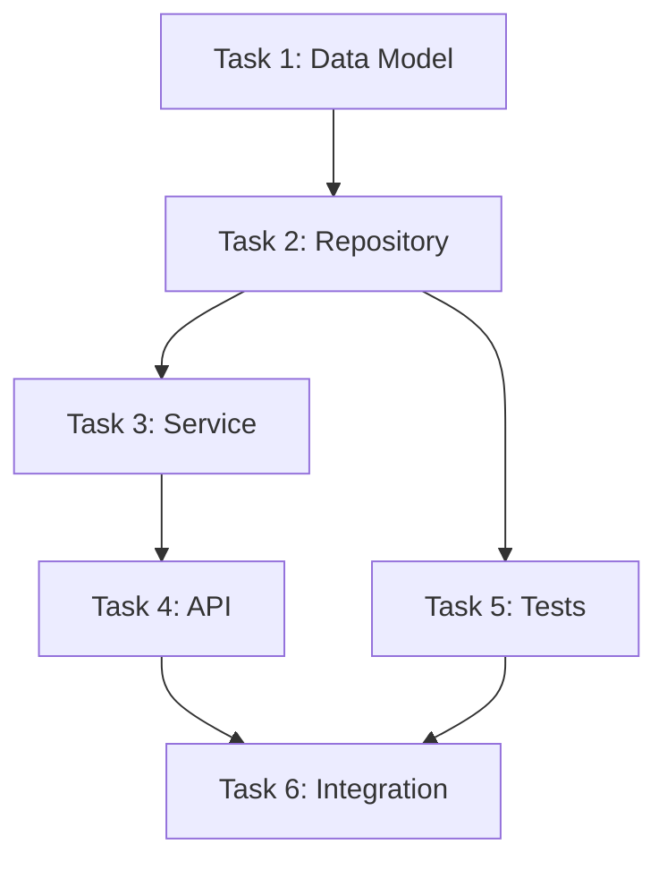

# Feature Planning

You are creating a detailed plan for a feature: requirements (what/why), design (how), and tasks (execution order). Visualize decisions with diagrams.

Use the same `[feature-name]` as the brainstorm (from the path to `requirements.md`), or ask the user which feature is being planned if unclear. All outputs go under `.cursor/specs/[feature-name]/`.

## Step 1: Understand Context

Before planning, analyze:
1. If `.cursor/specs/[feature-name]/requirements.md` exists, load it and use it as the source for problem, scope, approach, and success criteria.
2. Load and review CLAUDE.md
3. If `.cursor/foundation/` exists, load vision.md, decisions.md, architecture.md for project-level constraints.
4. Identify existing patterns in the codebase this feature should follow
5. List files/modules this feature will touch or extend

## Step 2: Refine Requirements (if needed)

If requirements.md is thin or missing sections, refine it. It should contain:
- Problem statement (what user problem, why it matters)
- Success criteria (measurable outcomes)
- Scope (in scope, out of scope)
- Chosen approach and key constraints

Do not duplicate this in design.md; design is "how," requirements are "what and why."

## Step 3: Create Design

Create `.cursor/specs/[feature-name]/design.md`:

````markdown
# Design: [Feature Name]

## Architecture

[How this feature fits into the system. Reference or extend .cursor/foundation/architecture.md if it exists.]



## Data Model / APIs

[New or changed tables, DTOs, API contracts. Rationale for key decisions.]

## Data Flow (if applicable)



## Risks and Mitigations

| Risk | Likelihood | Mitigation |
|------|------------|-------------|
| [Risk 1] | High/Med/Low | [How we'll handle it] |
````

Save diagrams as mermaid code blocks in design.md (or to `.cursor/specs/[feature-name]/diagrams/` if you prefer separate files).

## Step 4: Create Tasks

Create `.cursor/specs/[feature-name]/tasks.md`:

````markdown
# Tasks: [Feature Name]

## Task Dependency Graph



## Tasks

### Task 1: [Name]
**Status**: Not Started
**Depends On**: None
**Description**: [What this task accomplishes]
**Files**: [Files to create/modify]
**Verification**: [How we know it's done]
**Estimated Complexity**: Low/Medium/High

### Task 2: [Name]
...

## Checkpoints

After Task 2: Verify data layer works in isolation
After Task 4: Verify API contract matches design
After Task 6: Full integration verification
````

## Step 5: Initialize Review Log

Create `.cursor/specs/[feature-name]/review-log.md` if it does not exist:

````markdown
# Review Log: [Feature Name]

(Entries appended after each checkpoint or full review.)
````

## Step 6: Present and Iterate

Present the complete plan (requirements, design, tasks) with all diagrams. Ask:
1. Does the architecture make sense?
2. Are there missing tasks?
3. Are the dependencies correct?
4. Any concerns about the approach?

Iterate on the plan until approved. Do not proceed to implementation until explicit approval.
