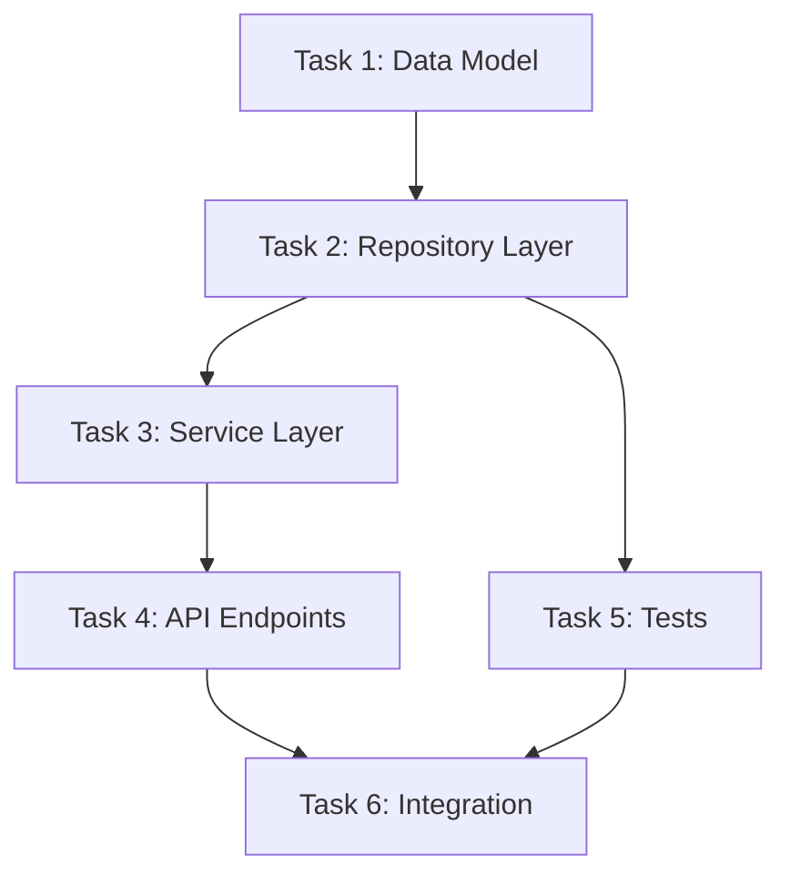

# Feature Planning

You are creating a detailed plan for a feature. Visualize decisions with diagrams.

Use the same `[feature-name]` as the brainstorm (from the path to `brainstorm.md`), or ask the user which feature is being planned if unclear. All outputs go under `docs/specs/[feature-name]/`.

## Step 1: Understand Context

Before planning, analyze:
1. If `docs/specs/[feature-name]/brainstorm.md` exists, load it and use it as the source for problem, scope, approach, and success criteria when creating the spec.
2. Load and review CLAUDE.md
3. Identify existing patterns in the codebase this feature should follow
4. List files/modules this feature will touch or extend

## Step 2: Create Specification

Generate docs/specs/[feature-name]/spec.md:
````markdown
# Feature: [Name]

## Problem Statement
[What user problem does this solve? Why does it matter?]

## Success Criteria
- [ ] [Measurable outcome 1]
- [ ] [Measurable outcome 2]

## Scope
### In Scope
- [What we're building]

### Out of Scope
- [What we're explicitly not building]

## Technical Context
### Existing Patterns to Follow
- [Pattern 1 from codebase]
- [Pattern 2 from codebase]

### Files to Modify
- [file]: [why]

### New Files to Create
- [file]: [purpose]
````

## Step 3: Architecture Diagram

Create a system diagram showing how components interact:
````mermaid
flowchart TD
    subgraph Existing["Existing System"]
        A[Component A]
        B[Component B]
    end
    
    subgraph New["New Feature"]
        C[New Component]
        D[New Component]
    end
    
    A --> C
    C --> D
    D --> B
    
    style New fill:#e1f5fe
````

Save to docs/specs/[feature-name]/diagrams/architecture.mermaid

## Step 4: Data Flow Diagram

If the feature involves data transformations:
````mermaid
flowchart LR
    Input["User Input"]
    Validate["Validation"]
    Process["Business Logic"]
    Store["Database"]
    Response["API Response"]
    
    Input --> Validate
    Validate -->|Valid| Process
    Validate -->|Invalid| Error["Error Response"]
    Process --> Store
    Store --> Response
````

## Step 5: Task Breakdown

Create docs/specs/[feature-name]/plan.md:
````markdown
# Implementation Plan

## Task Dependency Graph


## Tasks

### Task 1: [Name]
**Status**: Not Started
**Depends On**: None
**Description**: [What this task accomplishes]
**Files**: [Files to create/modify]
**Verification**: [How we know it's done]
**Estimated Complexity**: Low/Medium/High

### Task 2: [Name]
...

## Checkpoints

After Task 2: Verify data layer works in isolation
After Task 4: Verify API contract matches spec
After Task 6: Full integration verification
````

## Step 6: Risk Assessment
````
RISKS AND MITIGATIONS

┌─────────────────────┬─────────────┬────────────────────────┐
│ Risk                │ Likelihood  │ Mitigation             │
├─────────────────────┼─────────────┼────────────────────────┤
│ [Risk 1]            │ High/Med/Low│ [How we'll handle it]  │
│ [Risk 2]            │ High/Med/Low│ [How we'll handle it]  │
└─────────────────────┴─────────────┴────────────────────────┘
````

## Step 7: Present and Iterate

Present the complete plan with all diagrams. Ask:
1. Does the architecture make sense?
2. Are there missing tasks?
3. Are the dependencies correct?
4. Any concerns about the approach?

Iterate on the plan until approved. Do not proceed to implementation until explicit approval.