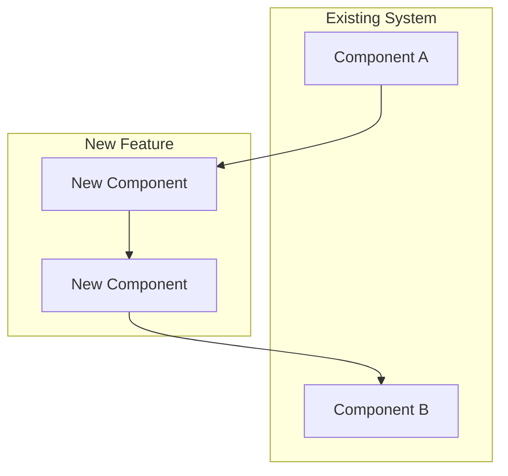
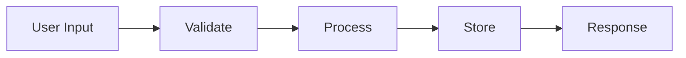
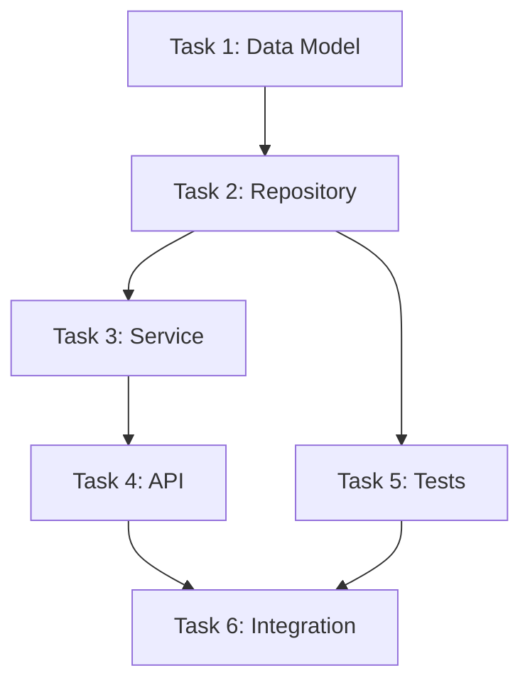

# Feature Planning

You are creating a detailed plan for a feature: requirements (what/why), design (how), and tasks (execution order). Visualize decisions with diagrams.

Use the same `[feature-name]` as the brainstorm (from the path to `requirements.md`), or ask the user which feature is being planned if unclear. All outputs go under `.cursor/specs/[feature-name]/`.

## Step 1: Understand Context

Before planning, analyze:
1. If `.cursor/specs/[feature-name]/requirements.md` exists, load it and use it as the source for problem, scope, approach, and success criteria.
2. Load and review CLAUDE.md
3. If `.cursor/foundation/` exists, load vision.md, decisions.md, architecture.md for project-level constraints.
4. Identify existing patterns in the codebase this feature should follow
5. List files/modules this feature will touch or extend

## Step 2: Refine Requirements (if needed)

If requirements.md is thin or missing sections, refine it. It should contain:
- Problem statement (what user problem, why it matters)
- Success criteria (measurable outcomes)
- Scope (in scope, out of scope)
- Chosen approach and key constraints

Do not duplicate this in design.md; design is "how," requirements are "what and why."

## Step 3: Create Design

Create `.cursor/specs/[feature-name]/design.md`:

````markdown
# Design: [Feature Name]

## Architecture

[How this feature fits into the system. Reference or extend .cursor/foundation/architecture.md if it exists.]



## Data Model / APIs

[New or changed tables, DTOs, API contracts. Rationale for key decisions.]

## Data Flow (if applicable)



## Risks and Mitigations

| Risk | Likelihood | Mitigation |
|------|------------|-------------|
| [Risk 1] | High/Med/Low | [How we'll handle it] |
````

Save diagrams as mermaid code blocks in design.md (or to `.cursor/specs/[feature-name]/diagrams/` if you prefer separate files).

## Step 4: Create Tasks

Create `.cursor/specs/[feature-name]/tasks.md`:

Break down the feature into tasks, ensuring each task:
- Has clear input/output contracts (schemas, examples)
- Includes specific verification criteria (testable predicates, not intentions)
- Splits at decision boundaries, not arbitrary size limits
- Covers edge cases from requirements.md

Use the template structure with Purpose, Input Contract, Output Contract, Requirements, Implementation Constraints, Files, Verification, and Edge Cases.

````markdown
# Tasks: [Feature Name]

## Task Dependency Graph



## Tasks

### Task 1: [Name - specific capability]
**Status**: Not Started
**Depends On**: None
**Purpose**: [Why this task exists]
**Input Contract**: [Explicit prerequisites]
**Output Contract**: [Explicit artifacts and state changes]
**Requirements**: [Must-haves and must-not-haves]
**Implementation Constraints**: [Technology/performance requirements if any]
**Files**: [Specific paths to create/modify]
**Verification**:
1. [Automated tests with concrete scenarios]
2. [Integration checks]
3. [Performance checks if relevant]
**Edge Cases**: [Boundary conditions to handle]
**Estimated Complexity**: Low/Medium/High

### Task 2: [Name]
...

## Checkpoints

After Task 2: Verify data layer works in isolation
After Task 4: Verify API contract matches design
After Task 6: Full integration verification
````

## Step 4.5: Validate Tasks

Before presenting the plan, validate each task:

**For each task, verify:**
- [ ] Input and output contracts are explicit (schemas or examples provided)
- [ ] Verification includes at least one concrete, automated test scenario
- [ ] If complexity is High, consider whether it can split at a decision boundary
- [ ] Edge cases from requirements.md are addressed in verification steps
- [ ] "Verification" contains falsifiable predicates, not vague intentions like "works correctly"

**Common issues to fix:**
- Vague verification: "Unit tests pass" → Specify which test scenarios
- Missing contracts: Add explicit schemas for inputs/outputs
- Oversized tasks: If a task has 3+ distinct decision points, split it
- Ambiguous edge cases: Document expected behavior for null/empty/boundary inputs

If any task fails validation, refine it before proceeding.

## Step 5: Initialize Review Log

Create `.cursor/specs/[feature-name]/review-log.md` if it does not exist:

````markdown
# Review Log: [Feature Name]

(Entries appended after each checkpoint or full review.)
````

## Step 6: Present and Iterate

Present the complete plan (requirements, design, tasks) with all diagrams. Confirm that:
1. All tasks passed validation (Step 4.5)
2. Architecture aligns with requirements and existing patterns
3. Task dependencies are correct
4. Verification criteria are specific and falsifiable

Ask the user:
1. Does the architecture make sense?
2. Are there missing tasks or edge cases?
3. Are the task boundaries appropriate (not too large, not over-prescribed)?
4. Any concerns about the approach?

Iterate on the plan until approved. Do not proceed to implementation until explicit approval.
