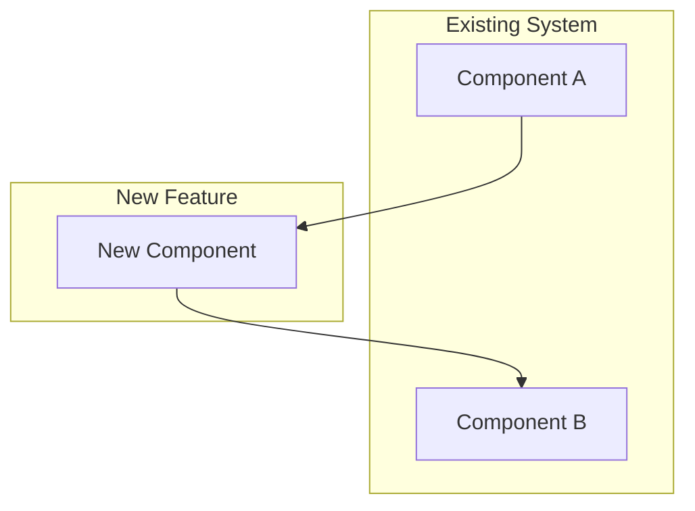
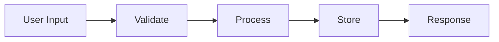

# Design: [Feature Name]

## Architecture
[How this feature fits into the system.]

## Data Model / APIs
[New or changed tables, DTOs, API contracts. Rationale for key decisions.]

## Data Flow (if applicable)

## Risks and Mitigations
| Risk | Likelihood | Mitigation |
|------|------------|------------|
| [Risk 1] | High/Med/Low | [How we'll handle it] |
