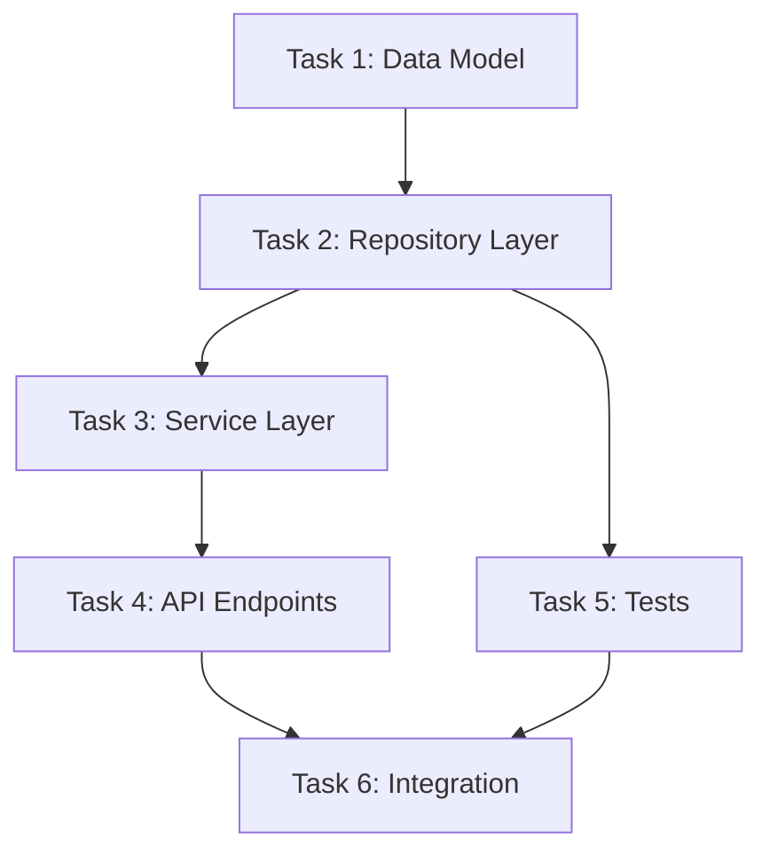

```markdown
# Implementation Plan

## Task Dependency Graph



## Tasks

### Task 1: [Name]
**Status**: Not Started
**Depends On**: None
**Description**: [What this task accomplishes]
**Files**: [Files to create/modify]
**Verification**: [How we know it's done]
**Estimated Complexity**: Low/Medium/High

### Task 2: [Name]
...

## Checkpoints

After Task 2: Verify data layer works in isolation  
After Task 4: Verify API contract matches spec  
After Task 6: Full integration verification
```

