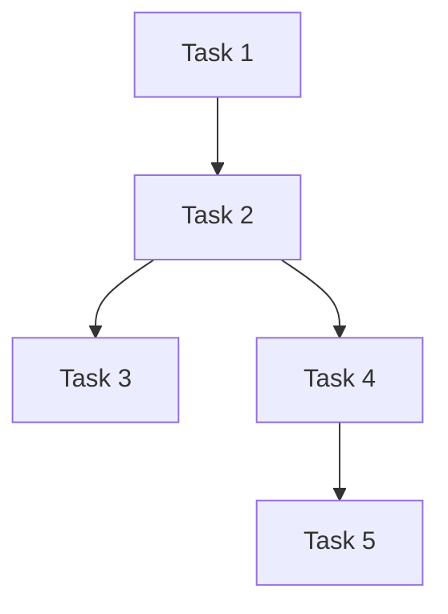

# Tasks: [Feature Name]

## Task Dependency Graph

## Tasks
### Task 1: [Name]
**Status**: Not Started
**Depends On**: None
**Description**: [What this task accomplishes]
**Files**: [Files to create/modify]
**Verification**: [How we know it's done]
**Estimated Complexity**: Low/Medium/High

### Task 2: [Name]
...

## Checkpoints
After Task 2: [Checkpoint description]
After Task 4: [Checkpoint description]
After Task 5: Full integration verification
