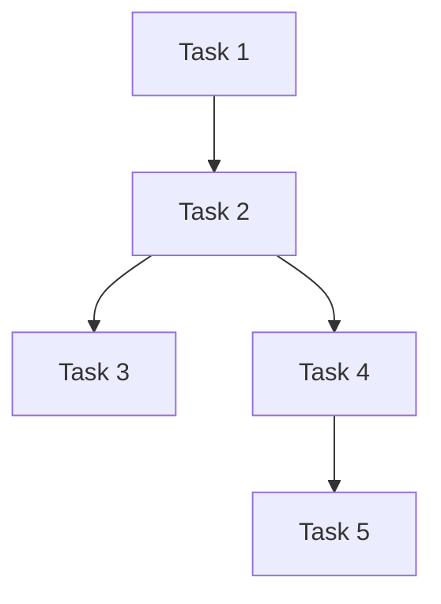

# Tasks: [Feature Name]

## Task Dependency Graph

## Tasks
### Task 1: [Name - specific capability, not implementation approach]

**Status**: Not Started
**Depends On**: None

**Purpose**: [One sentence: why this task exists in the context of the larger feature]

**Input Contract**:
- [Explicit files that must exist, DynamoDB state, environment variables, etc.]
- [Include schemas or example values where helpful]

**Output Contract**:
- [Explicit artifacts with schemas or example structures]
- [State transitions if applicable, e.g., "Races.processing_status: PENDING → PROCESSING"]

**Requirements**:
- [Must-haves: specific functional requirements]
- [Must-not-haves: constraints or forbidden behaviors]

**Implementation Constraints** (if any):
- [Technology requirements, e.g., "Use FFmpeg 4.4+"]
- [Performance bounds, e.g., "Must handle 4-hour 4K video"]
- [Suggested approach if there's a non-obvious algorithm, but allow implementation flexibility]

**Files to Create/Modify**:
- [Specific paths, e.g., src/services/video_processor.py, not just src/services/]

**Verification** (ordered by execution):
1. [Automated tests with specific test scenarios]
   - Example: test_empty_input → expected_output
   - Example: test_edge_case → expected_behavior
2. [Integration check with concrete example]
   - Example: Run against test-data-001, verify output matches expected schema
3. [Performance/scale verification if relevant]

**Edge Cases**:
- [What happens with empty/null inputs?]
- [Boundary conditions or special scenarios to handle]

**Estimated Complexity**: Low/Medium/High

---

### Task 2: [Name]
...

## Checkpoints
After Task 2: [Checkpoint description with specific verification criteria]
After Task 4: [Checkpoint description with specific verification criteria]
After Task 5: Full integration verification
