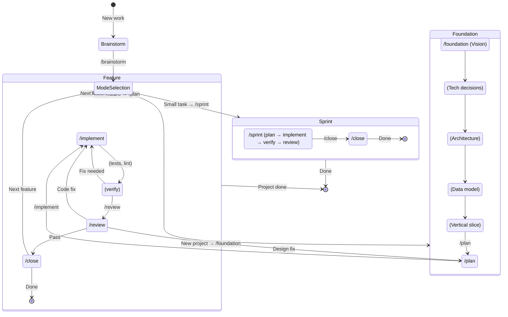

# threads-dev-v3

AI-assisted development workflow with structured phases and verification loops.

**Core premises:**
- Process overhead should scale with task risk
- Verification loops are non-negotiable regardless of task size
- Institutional memory compounds value over time

## Setup

To add this workflow to an existing project, run from the threads-system repo:

```bash
./setup-threads.sh /path/to/your-project
```

This copies `.cursor/`, `CLAUDE.md`, and `THREADS-README.md` into the target directory (existing files are overwritten). After copying, edit `CLAUDE.md` for your project’s tech stack and patterns (or just start `/brainstorm`ing), and adjust `.cursor/hooks.json` if your formatter differs from the default.

## Quick Start

1. **New problem?** Start with `/brainstorm`
2. **Problem clear?** Run `/plan`
3. **Plan approved?** Run `/implement`
4. **Code complete?** Run `/review`
5. **Review passed?** Run `/close`

## Workflow State Machine

At each step, run the command on the transition. Verification (tests, lint) is part of implement/review; only slash commands are shown.



**Command at each step:**

| Step | Command |
|------|--------|
| New work | `/brainstorm` |
| Problem clear, small task | `/sprint` then `/close` |
| Problem clear, new feature | `/plan` → `/implement` (repeat as needed) → `/review` → `/close` (or loop back to `/implement` / `/plan`) |
| New project | `/foundation` (Vision → Tech decisions → Architecture → Data model → Vertical slice), then `/plan` into feature flow |
| Done (sprint) | `/close` |
| Done (feature) | `/close` (merge/PR/keep/discard) |

## File Structure

```
.cursor/
├── foundation/               # Project-level (created by /foundation)
│   ├── vision.md            # Mission, constraints, non-goals
│   ├── decisions.md         # ADRs with rationale
│   └── architecture.md      # System-level diagrams
├── specs/                    # Feature-level (created per feature)
│   └── [feature-name]/
│       ├── requirements.md  # What and why
│       ├── design.md        # How (architecture, data model, APIs)
│       ├── tasks.md         # Execution sequence, checkpoints
│       └── review-log.md    # Review verdicts and learnings
├── rules/                    # Cursor rules files
│   ├── core.mdc
│   ├── planning.mdc
│   ├── implementation.mdc
│   ├── verification.mdc
│   ├── review.mdc
│   └── debugging.mdc
├── commands/                 # Slash commands
│   ├── brainstorm.md
│   ├── sprint.md
│   ├── plan.md
│   ├── implement.md
│   ├── review.md
│   ├── close.md
│   └── foundation.md
├── hooks.json
└── templates/
    ├── requirements.md
    ├── design.md
    ├── tasks.md
    ├── review-log.md
    └── review-checklist.md

CLAUDE.md                     # Institutional memory (keep under ~2.5k tokens)
```

## Key Concepts

### Brainstorm Before Plan

Most failed implementations trace back to underspecified problems. `/brainstorm` runs an iterative conversation to ensure you and the AI are solving the same problem before any code is written.

The brainstorm phase:
- Asks questions one at a time (not a checklist dump)
- Establishes explicit scope boundaries (in/out)
- Explores 2-3 approaches with tradeoffs
- Validates understanding before proceeding

### Verification vs Review

| Verification | Review |
|--------------|--------|
| Automated checks (tests, types, lint) | Human/AI judgment on design |
| Binary pass/fail | Subjective quality assessment |
| Run after every task | Run after task groups |
| Catches what breaks | Catches what's wrong |

Both happen. Verification first, then review.

### Sprint vs Feature Close

Sprint close: after a small task, you commit and report (no branch merge/PR flow). Feature close: after plan → implement → review on a branch, use `/close` to verify tests and choose merge, PR, keep branch, or discard.

### The Stuck Ladder

When progress stalls, escalate in order:

1. **Narrow the ask** — one file, one function
2. **Add concrete example** — explicit input/output
3. **Fresh context** — new session, clean problem statement
4. **Switch persona** — ask architect before coder
5. **Cut scope** — ship minimal slice, iterate
6. **Return to brainstorm** — the spec may be flawed

Don't keep rephrasing the same prompt hoping for different results.

### Systematic Debugging

When encountering bugs or test failures, use the 4-phase process:

1. **Root Cause Investigation** — Read errors, reproduce, check changes, trace data flow
2. **Pattern Analysis** — Find working examples, compare, identify differences
3. **Hypothesis Testing** — Form single hypothesis, test minimally, verify
4. **Implementation** — Create failing test, implement single fix, verify

**The 3-Fix Rule:** After 3+ failed fixes, stop fixing. You're likely solving the wrong problem. Question the architecture before attempting more fixes.

### Rules File Size

**Strong recommendation:** Keep total rules under ~2,500 tokens (~150 lines).

Verbose rules get ignored. Terse rules get followed. The Claude Code team's own file is 2.5k tokens. Most developers' files are 5-10x too long.

Add rules when mistakes happen, not preemptively.

## Hooks

Automatic formatting runs after every file write/edit:

```json
{
  "hooks": {
    "PostToolUse": [{
      "matcher": "Write|Edit|MultiEdit",
      "hooks": [{
        "type": "command",
        "command": "npm run format --silent 2>/dev/null || npx prettier --write . --log-level silent 2>/dev/null || true"
      }]
    }]
  }
}
```

Customize the command for your project's formatter.

## Usage Examples

### Starting Fresh

```
User: /brainstorm We need user notifications

Assistant: Let me understand this better before we plan.

What problem are we solving? When you say "notifications" - what's the
pain point today? Are users missing important events?

[Iterative conversation continues...]
[Output saved to .cursor/specs/notifications/requirements.md]

User: /plan notifications

Assistant: Based on the requirements, here's the design and task breakdown...
```

### Sprint (Small Fix)

```
User: /sprint Fix login button not responding on mobile

Assistant:
TASK: Fix login button unresponsive on mobile

AFFECTED FILES:
- src/components/LoginButton.tsx
- src/styles/auth.css

APPROACH: Check touch event handling and tap target size.

VERIFICATION:
- [ ] Button responds to touch on mobile
- [ ] Button still works with mouse
- [ ] No visual regression

Proceed? [Waiting for approval]
```

### Using the Stuck Ladder

```
User: This auth refactor keeps failing. I've tried three times.

Assistant: Let's use the stuck ladder.

Level 1 - Narrow: Instead of the full auth system, let's focus on
just the token refresh logic. One function, one file.

What's the specific behavior that's breaking?
```

---

## Sources & Influences

This workflow synthesizes principles from several cutting-edge sources on AI-assisted development:

### Primary Sources

**Boris Cherny** (Staff Engineer at Anthropic, Claude Code creator)
- [Original X thread on Claude Code workflow](https://x.com/bcherny/status/2007179832300581177)
- [Karo Zieminski's detailed breakdown](https://karozieminski.substack.com/p/boris-cherny-claude-code-workflow)
- [InfoQ summary](https://www.infoq.com/news/2026/01/claude-code-creator-workflow/)

Key concepts adopted: parallel session management, CLAUDE.md as institutional memory, plan mode before execution, verification loops as non-negotiable, slowest/smartest model preference, subagents as workflow atoms, stuck ladder.

**Armin Ronacher** (Creator of Flask)
- [Agentic Coding Recommendations](https://lucumr.pocoo.org/2025/6/12/agentic-coding/)

Key concepts adopted: tools must be fast and protected against misuse, logging as a tool for agents, language choice matters (Go recommendation), stability over churn, simple code over clever code, refactoring timing.

**Addy Osmani** (Google)
- [My LLM coding workflow going into 2026](https://addyosmani.com/blog/ai-coding-workflow/)

Key concepts adopted: spec-first development, breaking work into small chunks, extensive context provision, human-in-the-loop verification, commit discipline, customizing AI behavior with rules files.

**Superpowers** (Jesse Vincent)
- [Superpowers](https://github.com/obra/superpowers)

Inspiration for some prompts.

### Additional Sources

**Chris Dunlop** - ["Do you truly need to read the code from Cursor or Claude Code anymore?"](https://medium.com/@chrisdunlop_37984/do-you-truly-need-to-read-the-code-from-cursor-or-claude-code-anymore-87cf39abe54f)
- Perspective on code as infrastructure vs. literature, trust battery concept, risk-stratified verification.

**Marco Kotrotsos** - ["The AI Agent Race is Over"](https://medium.com/@kotrotsos)
- Agent Skills paradigm, skills as packaged expertise, the "folder as agent" concept from Anthropic's cookbook.

**ByteByteGo** - ["Top AI Agentic Workflow Patterns"](https://blog.bytebytego.com/p/top-ai-agentic-workflow-patterns)
- Reflection pattern, ReAct pattern, planning pattern, multi-agent pattern taxonomy.

### Methodology

These sources were analyzed to extract common principles, evaluate effectiveness based on real-world usage (particularly Boris Cherny's workflow as the benchmark for "what the tool creator actually does"), and synthesize into a unified workflow that scales from bug fixes to greenfield projects.

The core insight: process overhead should scale with task risk, verification loops are non-negotiable regardless of task size, and institutional memory compounds value over time.

---

## License

This project is licensed under the GNU General Public License v3.0 (GPLv3). This means:

- You can use, modify, and distribute this workflow freely
- If you distribute modified versions, you must release the source code under GPLv3
- Any derivative works must also be GPLv3-licensed

The license ensures that improvements remain publicly available. Organization-specific configurations (custom CLAUDE.md files, specific hooks, internal templates) can be kept private - only modifications to the core workflow structure itself require sharing.

See the [LICENSE](LICENSE) file for full terms.

## Changelog

**v3.3** - Specs under `.cursor/specs/` (requirements.md, design.md, tasks.md, review-log.md); foundation under `.cursor/foundation/` (vision.md, decisions.md, architecture.md). Three-layer structure and review log for audit trail.

**v3.2** - Added systematic debugging rules (4-phase + 3-fix rule), enhanced /close with test verification and 4-option workflow

**v3.1** - Added brainstorm phase, verification rules, stuck ladder, token guidance, formatting hooks

**v3.0** - Initial state machine workflow with Sprint/Feature/Foundation modes