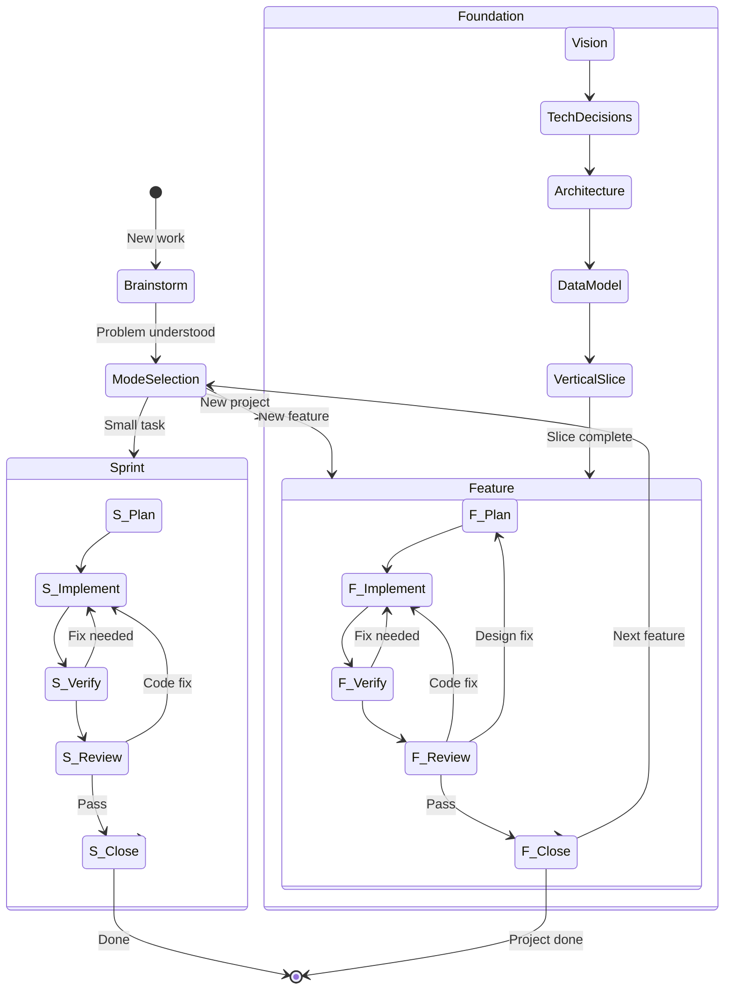

# threads-system-v3

AI-assisted development workflow with structured phases and verification loops.

## Quick Start

1. **New problem?** Start with `/brainstorm`
2. **Problem clear?** Run `/plan`
3. **Plan approved?** Run `/implement`
4. **Code complete?** Run `/review`
5. **Review passed?** Run `/close`

## Workflow State Machine



## File Structure

```
.cursor/
├── rules/                    # Cursor rules files
│   ├── core.mdc             # Always-loaded (includes stuck ladder, token guidance)
│   ├── planning.mdc         # Loaded during planning phases
│   ├── implementation.mdc   # Loaded during coding
│   ├── verification.mdc     # Loaded during verification
│   ├── review.mdc           # Loaded during review phases
│   └── debugging.mdc        # 4-phase debugging + 3-fix rule
├── commands/                 # Slash commands
│   ├── brainstorm.md        # Problem exploration (START HERE)
│   ├── sprint.md
│   ├── plan.md
│   ├── implement.md
│   ├── review.md
│   └── close.md
├── hooks.json               # PostToolUse formatting automation
└── templates/
    ├── spec.md
    ├── plan.md
    └── review-checklist.md

docs/
└── specs/
    └── [feature-name]/
        ├── brainstorm.md    # Problem exploration output
        ├── spec.md          # Feature specification
        ├── plan.md          # Implementation plan
        ├── diagrams/
        │   └── *.mermaid
        └── reviews/
            └── review-[n].md

CLAUDE.md                     # Institutional memory (keep under ~2.5k tokens)
```

## Key Concepts

### Brainstorm Before Plan

Most failed implementations trace back to underspecified problems. `/brainstorm` runs an iterative conversation to ensure you and the AI are solving the same problem before any code is written.

The brainstorm phase:
- Asks questions one at a time (not a checklist dump)
- Establishes explicit scope boundaries (in/out)
- Explores 2-3 approaches with tradeoffs
- Validates understanding before proceeding

### Verification vs Review

| Verification | Review |
|--------------|--------|
| Automated checks (tests, types, lint) | Human/AI judgment on design |
| Binary pass/fail | Subjective quality assessment |
| Run after every task | Run after task groups |
| Catches what breaks | Catches what's wrong |

Both happen. Verification first, then review.

### Sprint vs Feature Close

Sprint close: after a small task, you commit and report (no branch merge/PR flow). Feature close: after plan → implement → review on a branch, use `/close` to verify tests and choose merge, PR, keep branch, or discard.

### The Stuck Ladder

When progress stalls, escalate in order:

1. **Narrow the ask** — one file, one function
2. **Add concrete example** — explicit input/output
3. **Fresh context** — new session, clean problem statement
4. **Switch persona** — ask architect before coder
5. **Cut scope** — ship minimal slice, iterate
6. **Return to brainstorm** — the spec may be flawed

Don't keep rephrasing the same prompt hoping for different results.

### Systematic Debugging

When encountering bugs or test failures, use the 4-phase process:

1. **Root Cause Investigation** — Read errors, reproduce, check changes, trace data flow
2. **Pattern Analysis** — Find working examples, compare, identify differences
3. **Hypothesis Testing** — Form single hypothesis, test minimally, verify
4. **Implementation** — Create failing test, implement single fix, verify

**The 3-Fix Rule:** After 3+ failed fixes, stop fixing. You're likely solving the wrong problem. Question the architecture before attempting more fixes.

### Rules File Size

**Strong recommendation:** Keep total rules under ~2,500 tokens (~150 lines).

Verbose rules get ignored. Terse rules get followed. The Claude Code team's own file is 2.5k tokens. Most developers' files are 5-10x too long.

Add rules when mistakes happen, not preemptively.

## Hooks

Automatic formatting runs after every file write/edit:

```json
{
  "hooks": {
    "PostToolUse": [{
      "matcher": "Write|Edit|MultiEdit",
      "hooks": [{
        "type": "command",
        "command": "npm run format --silent 2>/dev/null || npx prettier --write . --log-level silent 2>/dev/null || true"
      }]
    }]
  }
}
```

Customize the command for your project's formatter.

## Usage Examples

### Starting Fresh

```
User: /brainstorm We need user notifications

Assistant: Let me understand this better before we plan.

What problem are we solving? When you say "notifications" - what's the
pain point today? Are users missing important events?

[Iterative conversation continues...]
[Output saved to docs/specs/notifications/brainstorm.md]

User: /plan notifications

Assistant: Based on the brainstorm, here's the implementation plan...
```

### Sprint (Small Fix)

```
User: /sprint Fix login button not responding on mobile

Assistant:
TASK: Fix login button unresponsive on mobile

AFFECTED FILES:
- src/components/LoginButton.tsx
- src/styles/auth.css

APPROACH: Check touch event handling and tap target size.

VERIFICATION:
- [ ] Button responds to touch on mobile
- [ ] Button still works with mouse
- [ ] No visual regression

Proceed? [Waiting for approval]
```

### Using the Stuck Ladder

```
User: This auth refactor keeps failing. I've tried three times.

Assistant: Let's use the stuck ladder.

Level 1 - Narrow: Instead of the full auth system, let's focus on
just the token refresh logic. One function, one file.

What's the specific behavior that's breaking?
```

---

## Changelog

**v3.2** - Added systematic debugging rules (4-phase + 3-fix rule), enhanced /close with test verification and 4-option workflow

**v3.1** - Added brainstorm phase, verification rules, stuck ladder, token guidance, formatting hooks

**v3.0** - Initial state machine workflow with Sprint/Feature/Foundation modes
