# Threads

**Hierarchical AI Workflow System**

Threads is a lightweight workflow management system designed for AI-assisted development. It provides transparency, context management, atomization, and validation for AI coding sessions.

## Quick Start

```bash
# Initialize Threads in your project
./init-threads.sh

# Or add bin/ to your PATH and use:
threads init

# Create your first goal
threads goal new "Add user authentication"

# Create a plan
threads plan new "Implement OAuth with Google"

# Approve and start the plan
threads plan approve
threads plan start

# Create tasks
threads task new "Configure OAuth credentials"
threads task new "Create auth callback endpoint"
threads task new "Add session management"

# Start working
threads task start
# ... do the work ...
threads done

# Continue with next task
threads task next
```

## Core Concepts

### Hierarchy

Threads uses a four-level hierarchy:

```
Goal (What you want to achieve)
  └── Plan (How you'll achieve it)
        └── Task (Specific work item)
              └── Action (Atomic step)
```

- **Goals**: High-level objectives that may span multiple sessions
- **Plans**: Approaches to achieve goals, with rationale and alternatives
- **Tasks**: Discrete work items with clear acceptance criteria
- **Actions**: Atomic operations that can be validated and reversed

### Context Layers

Context accumulates at each level:

1. **Project Context** - Tech stack, patterns, constraints, learnings
2. **Goal Context** - Relevant files, decisions, requirements
3. **Plan Context** - Approach details, dependencies
4. **Task Context** - Implementation notes, blockers
5. **Action Context** - Pre/post state, validation results

### Right-Sizing

Threads adapts to work scope:

| Scope | Example | Process |
|-------|---------|---------|
| Trivial | Fix typo | Direct action |
| Small | Add validation | Task only |
| Medium | New feature | Goal → Plan → Tasks |
| Large | Major refactor | Full hierarchy + checkpoints |

## Commands

### Status & Navigation

```bash
threads status          # Show current workflow state
threads s               # Alias for status
threads status --detail # Detailed view
threads status --tree   # ASCII tree view of entire workflow
```

### Goals

```bash
threads goal new "title"     # Create a new goal
threads goal list            # List all goals
threads goal show [id]       # Show goal details
threads goal select <id>     # Select goal as active
threads goal update "desc"   # Update goal description
```

### Plans

```bash
threads plan new "title"     # Create plan for current goal
threads plan list            # List plans in current goal
threads plan show [id]       # Show plan details
threads plan select <id>     # Select plan as active
threads plan approve [id]    # Approve a proposed plan
threads plan start [id]      # Start working on plan
```

### Tasks

```bash
threads task new "title"     # Create task in current plan
threads task list            # List tasks in current plan
threads task select <id>     # Select task as active
threads task start [id]      # Start working on task
threads task next            # Select next pending task
```

### Completion

```bash
threads done                 # Complete current task
threads done task            # Same as above
threads done plan            # Complete current plan
threads done goal            # Complete current goal
threads done --failed        # Mark as failed/abandoned
```

### Reflection (Self-Critique)

The reflection pattern enables AI to critique its own work before treating it as final:

```bash
threads reflect                      # General self-critique
threads reflect --focus accuracy     # Check facts, logic, edge cases
threads reflect --focus clarity      # Check readability, structure
threads reflect --focus completeness # Check if requirements are met
threads reflect --focus security     # Check for vulnerabilities
threads reflect --focus performance  # Check for inefficiencies
threads reflect --focus criteria     # Check against acceptance criteria
```

The reflection output includes:
- **Summary**: Overall assessment
- **Strengths**: What's working well
- **Issues Found**: Problems with severity (high/medium/low)
- **Suggested Improvements**: Specific actionable fixes
- **Criteria Assessment**: ✓ Met / ⚠ Partial / ✗ Not met
- **Updated Confidence Score**: 0.0-1.0 with justification
- **Recommendation**: proceed / revise / block

**Recommended workflow:**
```bash
threads task start           # Start working
# ... do the work ...
threads reflect --focus criteria  # Self-critique
# ... fix any issues found ...
threads done                 # Complete when reflection passes
```

### Context & Learning

```bash
threads context show              # Show accumulated context
threads context add stack "Node.js 20"
threads context add pattern "Services in src/services/"
threads context add constraint "Must support IE11"
threads context add file "src/auth/oauth.ts"
threads context decide "Use JWT" "Better for stateless scaling"

threads learn "Always validate OAuth state parameter"
threads learn list
threads learn invalidate <id>     # Mark learning as no longer valid
```

### Checkpoints & Reversibility

```bash
threads checkpoint "Before refactor"  # Create checkpoint
threads cp                            # Alias
threads revert --list                 # List checkpoints
threads revert <id>                   # Restore from checkpoint
```

### Validation & Testing

```bash
threads validate             # Validate YAML files
threads validate --fix       # Auto-fix issues
threads test                 # Run validation checks
threads test --all           # Run all checks
```

### Visualization

```bash
threads diagram              # Generate Mermaid flowchart
threads diagram --gantt      # Generate Gantt progress chart
threads diagram --state      # Generate state diagram
threads diagram -o file.md   # Save diagram to file
threads diagram --goal <id>  # Diagram for specific goal only
```

The `--tree` flag on status provides a quick ASCII visualization:

```
THREADS WORKFLOW TREE

├── → Goal: Add user authentication ★
│   └── ◉ Plan: OAuth with Google ★
│       ├── ✓ Configure OAuth credentials
│       ├── → Create auth callback endpoint ★
│       ├── ○ Add session management
│       └── ○ Write integration tests
└── ○ Goal: Improve performance
    └── ○ Plan: Database optimization

Legend: ○ pending  → in progress  ✓ completed  ✗ blocked/failed  ★ current
```

The `diagram` command generates Mermaid diagrams that render in GitHub, VS Code, and many documentation tools:

```mermaid
flowchart TD
    subgraph project["my-project"]
        G1["🎯 Add user authentication"]:::current
        G1P1["📋 OAuth with Google"]:::current
        G1 --> G1P1
        G1P1T1(["Configure credentials"]):::completed
        G1P1T2(["Auth callback"]):::inprogress
        G1P1T3(["Session management"]):::pending
        G1P1 --> G1P1T1
        G1P1 --> G1P1T2
        G1P1 --> G1P1T3
    end

    classDef pending fill:#f5f5f5,stroke:#999
    classDef inprogress fill:#e3f2fd,stroke:#1976d2
    classDef completed fill:#e8f5e9,stroke:#4caf50
    classDef current fill:#fff9c4,stroke:#fbc02d,stroke-width:3px
```



### Export

```bash
threads export               # Export current goal as markdown
threads export <goal-id>     # Export specific goal
threads export --diagram     # Include Mermaid diagram in export
threads export --list        # List available goals
threads export -o file.md    # Output to file
```

### Git Integration

```bash
threads hooks install        # Install git hooks
threads hooks uninstall      # Remove git hooks
```

## Directory Structure

```
.threads/
├── config.yaml              # Global configuration
├── current.yaml             # Active context pointer
├── context/
│   └── project.yaml         # Project-level context
├── goals/
│   └── g-YYYYMMDDHHMMSS/
│       ├── goal.yaml
│       ├── context.yaml
│       └── plans/
│           └── p-YYYYMMDDHHMMSS/
│               ├── plan.yaml
│               └── tasks/
│                   └── t-YYYYMMDDHHMMSS/
│                       └── task.yaml
├── checkpoints/
│   └── cp-NNN/              # File snapshots
├── schemas/                 # YAML templates
│   ├── goal.yaml
│   ├── plan.yaml
│   └── task.yaml
└── SKILL.md                 # AI instructions
```

## Configuration

Edit `.threads/config.yaml`:

```yaml
# Confidence thresholds for AI decisions
confidence:
  proceed_threshold: 0.8     # Auto-proceed above this
  warn_threshold: 0.5        # Warn between warn and proceed
  block_threshold: 0.5       # Block and ask below this

# Checkpoint behavior
checkpoints:
  auto_checkpoint: true      # Auto-checkpoint on commits
  max_checkpoints: 50        # Keep last N checkpoints
  checkpoint_on_task: true   # Checkpoint when task completes

# Right-sizing thresholds
right_sizing:
  trivial_threshold: 1       # Direct action
  small_threshold: 5         # Task only
  medium_threshold: 20       # Plan required
  large_threshold: 50        # Full hierarchy
```

## Workflow Example

### Session 1: Planning

```bash
# Start a new goal
threads goal new "Add real-time notifications"

# AI explores and creates a plan
threads plan new "WebSocket-based notification system"

# Review the plan
threads plan show

# Approve it
threads plan approve

# Create initial tasks
threads task new "Set up WebSocket server"
threads task new "Create notification service"
threads task new "Add client-side handlers"
threads task new "Implement notification UI"
```

### Session 2: Implementation

```bash
# Check where we left off
threads status

# Start the first task
threads task start

# ... implement the feature ...

# Self-critique before completing
threads reflect --focus criteria

# Fix any issues the reflection identified
# ...

# Capture what we learned
threads learn "WebSocket requires sticky sessions with load balancer"

# Complete the task (reflection passed)
threads done

# Move to next task
threads task next
```

### Session 3: Continuation

```bash
# Seamless resume
threads status
# Shows: "Working on 'Create notification service'"
# Shows: Context from previous sessions

# Continue working
threads task start

# Record a decision
threads context decide "Use Redis pub/sub for multi-instance" "Scales horizontally"

# Complete task
threads done
```

## For AI Assistants

When working with Threads:

1. **Always check status first**: `threads status` or `threads status --tree`
2. **Read context before acting**: `threads context show`
3. **Break work into tasks**: Keep tasks small and verifiable
4. **Reflect before completing**: `threads reflect --focus criteria` catches issues early
5. **Capture learnings**: Document discoveries for future sessions
6. **Checkpoint before risky changes**: `threads checkpoint "description"`
7. **Mark confidence levels**: Flag uncertainty explicitly
8. **Generate diagrams for review**: `threads diagram` helps humans validate structure

### The Reflection Pattern

Before marking any significant work as complete, run a self-critique:

```bash
threads reflect --focus criteria
```

This implements the **Reflection Pattern** from agentic workflows - the AI evaluates its own work, identifies weaknesses, and suggests improvements before the human reviews it. This catches errors early and improves output quality.

**When to reflect:**
- Before `threads done` on any non-trivial task
- When confidence is below 0.8
- After making significant changes
- When the task has specific acceptance criteria

See `.threads/SKILL.md` for detailed AI instructions.

## Human Validation

Threads prioritizes human oversight. Use these visualization tools to quickly validate AI work:

| Need | Command | Output |
|------|---------|--------|
| Quick status check | `threads status --brief` | One-line summary |
| See full workflow | `threads status --tree` | ASCII tree in terminal |
| Review structure | `threads diagram` | Mermaid flowchart |
| Track progress | `threads diagram --gantt` | Gantt timeline |
| Understand state | `threads diagram --state` | State machine view |
| Full documentation | `threads export --diagram` | Markdown with visuals |

Diagrams render automatically in:
- GitHub README/issues/PRs
- VS Code with Mermaid extension
- Notion, Obsidian, and many note-taking apps
- Any Mermaid-compatible viewer

## Principles

1. **Transparency**: Humans can always see what AI is doing and why
2. **Context Management**: Context accumulates and transfers across sessions
3. **Atomization**: Work is broken into verifiable chunks
4. **Validation**: Every change can be checked and reversed
5. **Progressive Disclosure**: Start simple, add detail as needed
6. **Explicit Uncertainty**: Confidence levels guide human involvement

## License

MIT

## Contributing

Contributions welcome! Please ensure changes include:
- Updated tests
- Documentation updates
- Backward compatibility or migration path
